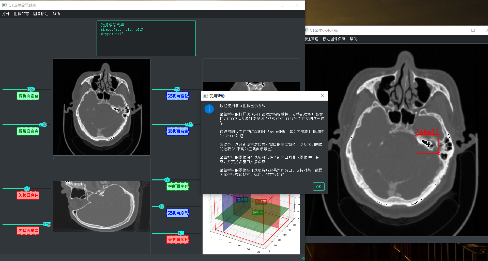
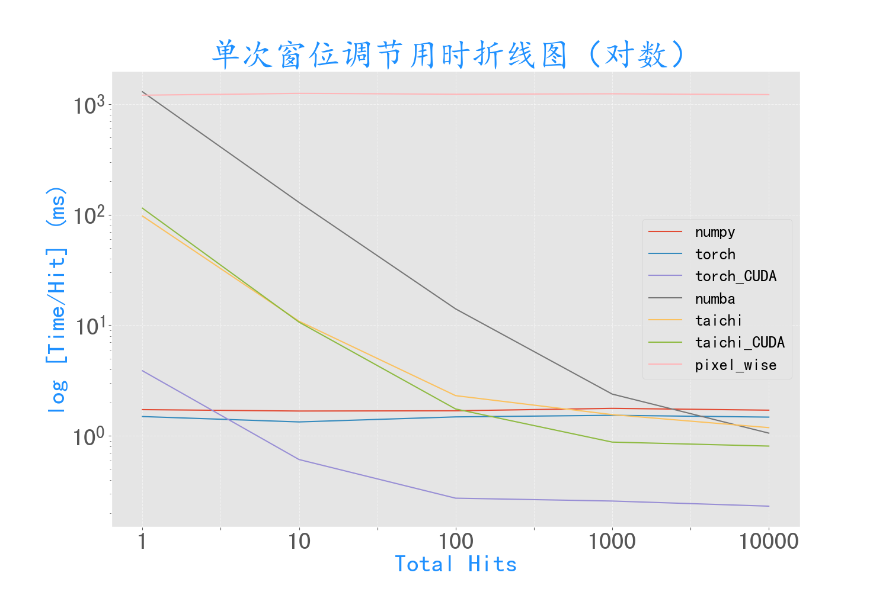

# CT图像标注系统

OpenCV课程结课作业，使用Pyqt5制作了交互式CT图像显示与标注系统

## 系统环境
- 本项目测试于Python3.9

- 使用到的库详见[requirements.txt](./requirements.txt)文件，其中使用了simpleitk库将DICOM类型的CT数据转换为array，pytorch库仅用于读取以pt文件存储的CT图像数据，以上两库为可选。
  

## 数据下载
可以从[此处](https://drive.google.com/drive/folders/1z-UmHsR2IqKwHsbxdKyMTT59qmnDEh6V?usp=share_link)下载表示相同CT数据的3种格式：DICOM、图像、pt序列，仅用于测试本项目代码

## 系统特性
- 支持多种数据格式的打开读取，包括DICOM类型，各种图像类型如PNG、JPG、TIF、BMP，以及保存的三维的tensor。

- 对于CT图像的三个截面，支持滑动条动态调整显示的窗位和窗宽，以及三截面的示意图。

- 支持单独打开某个截面进行标注，在标注系统中可以移动图片，滚轮缩放图片，对标注框进行添加、修正、删除以及命名管理。

- 支持随时对显示系统的四个子图进行分别保存和拼接保存，以及对标注系统的图像保存。

## 优化加速
尝试分析了图像的读取和窗位调节的加速，使用了不同的运算库包括numpy，pytorch，numba等，如下图：

事实上，由于无法在pyqt5中调用方法显示实时运算速度，以上实验结果仅供参考，本项目实际以numpy进行处理，也便于直接进行后续的图像显示。

值得一提的是，以上图像截面进行的操作在APP交互中已经非常流程，没有太大优化必要；但是加入了右下的三维示意图之后，有明显的卡顿感觉。单独分析后发现：约20%的时间消耗在创建3d的fig上，75%的时间消耗在plt.show()的图像渲染上，可以考虑后续进一步优化。
